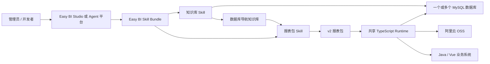
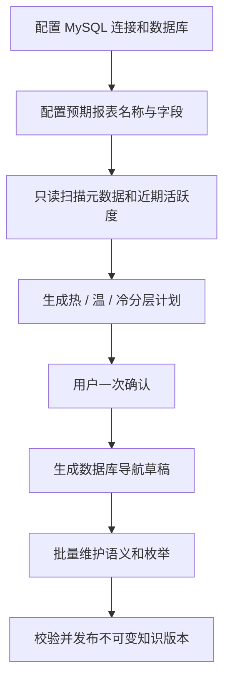
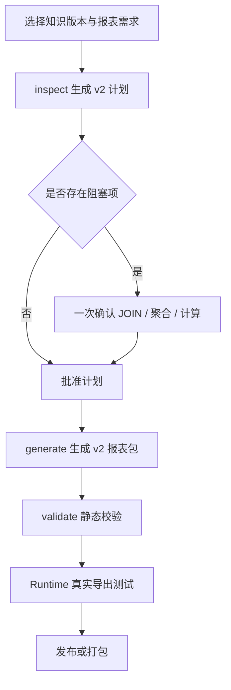

# Easy BI 总体架构

## 1. 产品定位

Easy BI 是一套面向业务系统的可插拔报表能力。AI 平台负责通过对话配置数据库、生成知识库、生成并测试报表包；发布后的 TypeScript Runtime 独立部署，通过统一接口为 Java/Vue 等业务系统提供报表查询和 Excel 导出。

第一阶段基线：

- 数据源：MySQL，一个工作区可配置多个连接和多个数据库；
- 对象存储：阿里云 OSS，仅异步导出需要；
- 运行环境：Node.js 24 LTS 与 TypeScript；
- 报表格式：计划和报表包只支持 v2；
- 交付方式：本地 Skill Bundle、独立工作区和无 Docker Linux 制品；
- AI 平台：Codex、Claude Code、Innos 等只要能读写工作区并执行 CLI 即可接入。

## 2. 总体结构



职责边界：

| 组件 | 职责 |
|---|---|
| Studio / Agent 平台 | 工作区管理、配置编辑、对话执行、差异确认、测试和发布 |
| 知识库 Skill | 连接 MySQL、扫描元数据、冷热分层、语义和枚举维护、发布知识库 |
| 报表包 Skill | 从知识库和报表需求生成 v2 计划、SQL、筛选 Schema、Transform 和测试 |
| 共享 Runtime | 查询编译、MySQL 只读执行、Excel、同步/异步导出、OSS 和业务任务回调 |
| 具体报表包 | 只保存该报表的字段、查询模型、计算逻辑、知识锁和测试 |
| 业务系统 | 用户权限、租户上下文、报表入口、筛选页面和任务中心 |

## 3. 工程与工作区

正式源目录：

```text
easy-bi/
├── docs/
│   ├── 文档导航.md
│   ├── 总体架构.md
│   └── 开发维护指南.md
├── skills/
│   ├── bundle.manifest.json
│   ├── index.json
│   ├── 目录与项目兼容性规范.md
│   ├── initialize-report-knowledge/
│   └── create-report-package/
├── toolkit/
│   ├── config/
│   └── contracts/
└── workspace.json
```

客户工作区：

```text
<workspace>/
├── workspace.json
├── config/easy-bi.json
├── skills/
│   ├── bundle.manifest.json
│   ├── bundle.lock.json
│   └── ...
├── toolkit/config/runtime.json
├── knowledge/
│   ├── scans/
│   ├── drafts/
│   └── versions/
├── reports/
│   ├── index.json
│   ├── plans/
│   └── packages/
├── outputs/
└── work/
```

一个工作区只对应一个客户业务系统。不同工作区拥有独立的配置、知识库、报表、输出和 Bundle Lock，不能共享可写 Skill 目录。

## 4. Skill Bundle 与跨平台接入

`skills/bundle.manifest.json` 是机器可读入口，声明：

- Bundle 和两个 Skill 的版本；
- CLI 与 Agent 入口；
- 支持的配置、知识库、报表和 Runtime API 版本；
- 工作区逻辑路径；
- 初始化模板与空索引；
- 自动初始化和升级策略；
- 文件哈希与兼容规范位置。

平台接入时应实现统一的 `SkillBundleSource` 和 `Workspace/Skill Adapter`：

```text
Skill 来源
  → 按版本写入本地不可变缓存
  → 独立安装到工作区
  → 写入 bundle.lock.json
  → 根据 Manifest 初始化或检查工作区
```

首期来源是本地目录；接口可扩展为本地压缩包、平台内置 Bundle 和 HTTP Registry。页面和业务服务不得自行硬编码 Skill 私有路径。

## 5. 知识库流程



关键约定：

- 热表保存完整字段和语义，温表保存可检索字段，冷表只保存表级摘要；
- 可靠的 90 天无数据证据默认判冷，强制热表和明确报表依赖可覆盖；
- 优先使用索引时间字段；无索引时允许带超时的近期存在性查询；
- 报表需求是热表判断的重要证据，避免逐表问答；
- 知识库按 `profile/database/table` 导航；
- 草稿允许人工编辑，发布版本不可原地修改；
- 枚举统一保存在 `global/enums.json`，相同业务字典可以被多个表字段复用；
- 扫描和重跑不得覆盖人工语义或已有中文枚举标签。

## 6. 报表包流程



报表包支持：

- 单表与多表 `LEFT/INNER JOIN`；
- 字段来源 `column`、`sql_expression` 和 `computed`；
- SQL 聚合、`GROUP BY`、参数化 `HAVING`；
- 逐行和按连续分组的 TypeScript Transform；
- 统一的字符串、数字、枚举和时间筛选 Schema；
- 创建时间倒序，缺失时按 ID 倒序；
- 可选租户上下文，不作为可见筛选项；
- v2 知识锁、文件校验和与版本化目录。

公共 MySQL、Excel、OSS、HTTP、任务队列和错误逻辑只存在于共享 Runtime，不复制到具体报表包。

## 7. Runtime 与业务系统

Runtime 固定提供三个接口：

| 方法 | 路径 | 用途 |
|---|---|---|
| `GET` | `/api/v1/reports` | 查询可用报表 |
| `GET` | `/api/v1/reports/{reportId}/parameters` | 查询动态筛选参数 |
| `POST` | `/api/v1/exports` | 按 `executionMode` 导出 |

HTTP `/api/v1` 是接口版本，与报表包格式 v2 无关。

同步分支：

1. 校验报表和筛选；
2. 参数化执行只读 SQL；
3. 流式写入 Excel，最多两个 Sheet；
4. 完整校验后以 HTTP 200 返回 xlsx。

异步分支：

1. 校验 OSS 和业务任务配置；
2. 调业务系统创建任务；
3. 持久队列生成 Excel；
4. 上传 OSS；
5. 回调业务系统更新文件地址和状态；
6. 失败时回调失败状态。

所有 JSON 成功和业务错误统一返回 HTTP 200，由 `success` 和标准错误对象区分。同步成功通过 `Content-Type` 返回 xlsx。

## 8. 配置边界

构建期配置：`config/easy-bi.json`

- 项目标识；
- MySQL Profile 和数据库列表；
- 知识库阈值与报表需求；
- 可选对象存储 Profile；
- 不进入知识库发布版本的连接凭据。

运行期配置：`toolkit/config/runtime.json`

- HTTP、同步/异步策略和资源上限；
- MySQL Profile 引用；
- 阿里云 OSS；
- 业务任务接口；
- 本地输出和 SQLite 队列路径。

知识库初始化不依赖 OSS。异步导出缺少 OSS 或任务接口时必须明确失败，不能静默切换同步。

## 9. 版本基线

| 契约 | 当前版本 |
|---|---:|
| Bundle | `1.2.x` |
| 工作区格式 | `1` |
| 构建配置格式 | `4` |
| 知识库格式 | `3` |
| 报表计划格式 | `2` |
| 报表包格式 | `2` |
| Runtime 配置格式 | `1` |
| Runtime HTTP API | `v1` |

报表计划和报表包 v1 已停止支持，不迁移、不执行。旧资产由工作区所有者明确删除，再基于当前知识库和报表需求重新生成 v2。

## 10. 部署与交付

开发阶段可以直接在 Studio 或 Agent 工作区运行。服务器制品不要求 Docker，推荐：

```text
easybi-runtime/
├── bin/
├── skills/
├── toolkit/
├── reports/
├── config/
├── data/
└── outputs/
```

使用预构建 Node.js Runtime 或单文件可执行制品配合 systemd，由网关按既有微服务规范反向代理。Java 系统继续负责身份、租户、菜单和任务中心。

## 11. 核心设计原则

- Skill 与平台通过文件契约和 CLI 解耦；
- Bundle 版本不可变，工作区不得静默升级；
- AI 负责理解和生成，CLI 负责确定性执行和校验；
- 数据库访问只读，所有请求值参数化；
- 人工语义、已发布知识和报表版本不可覆盖；
- 新增报表只增加报表包，不增加专用服务代码；
- 先在独立 Studio 验证，再通过适配层接入 Innos；
- 文档只保留稳定架构、Skill 说明、开发维护规范和运行接口契约。
